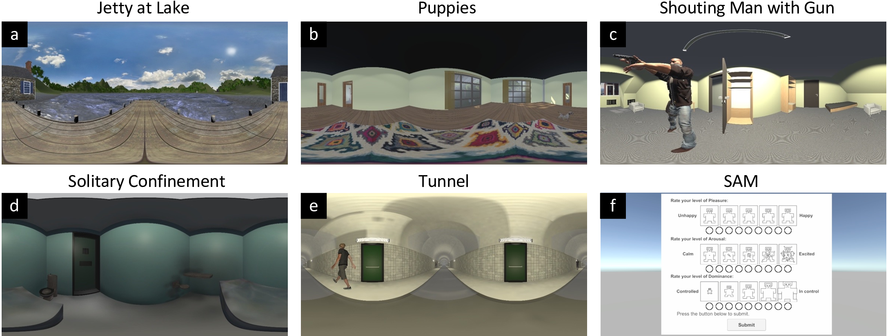
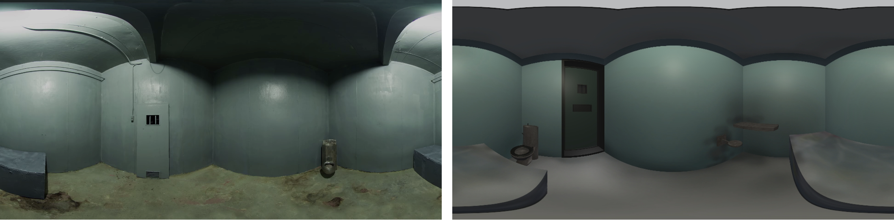
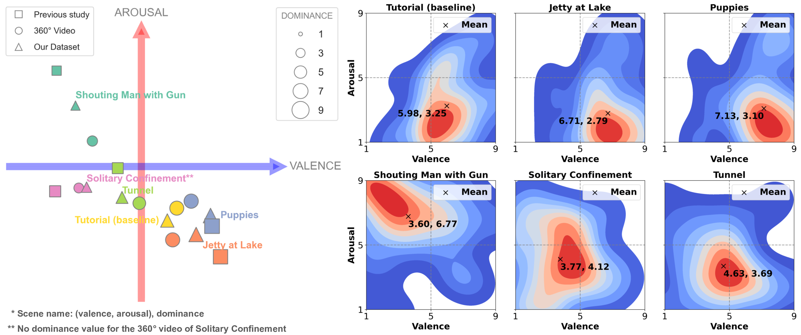
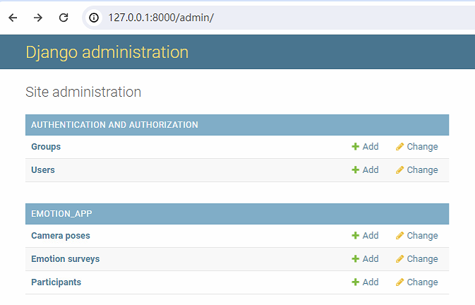

# VR-Dataset-Emotions
This repository is for our paper published in TVCG "_An Immersive and Interactive VR Dataset to Elicit Emotions_".

This dataset includes:
- Five VR scenes that can elicit different emotions.
- An example VR app that includes all the five scenes, including an interactive SAM qestionnaire scene.
- [Optional] A server that can record the user's behavior and SAM reports.



## Scene Modeling
Our VR scenes are modeled based on the original validated 360° video scenes. The modeling process includes:
1. **Scene Selection**: Select the scenes that can elicit the targeted emotions.
1. **Scene Modeling**: Model the scenes in Unity and Blender with the same content and layout as the original 360° video scenes.
1. **Lighting and Texturing**: Adjust the lighting and texturing to make the scenes more immersive.
1. **Interaction Design**: Enable users to be able to teleport to explore the scenes.

An example comparison between the original 360° video scene (left) and the modeled VR scene (right) is shown below:



## Targeted Emotions
Our dataset has been validated by 160 participants (80 participants for modeled VR scenes, 80 participants for the original 360° video scenes). The mean values of the targeted emotions are shown below:


For more details about the dataset, please refer to our paper here: _(to be published)_


## Environment Requirements
- Unity 2021.3 Long-Term-Support (LTS) version.
- OpenXR plugin for Unity.
- VR headset: the VR app was tested on Oculus Quest 2, you may need to modify the settings for other VR devices.
- [Optional] Python 3 with Django. 

## Quick Start
### Test VR Scenes
1. Download or clone this repository.
1. Load the Unity project in the `unity` folder.
1. For each scene, open the scene file in the `Scenes` folder and press the play button to test the scene.
1. [Optional] Build and deploy the VR app to your VR headset: 
    - Go to `File` -> `Build Settings` -> `Build` to build the app.
    - Follow the instructions to deploy the app to your VR headset.

### [Optional] Remote Server
The remote server is for recording user's behavior and SAM reports in VR using Django. You need to install Django to run the server:
```
pip install numpy django django-cors-headers
```
It is recommended to use a virtual environment such as venv or Anaconda.

#### For quick test, go to the `server` folder and run the server.

You may need to create a superuser to access the admin page:
```bash
python manage.py changepassword admin
```

Then run the server:
```bash
python manage.py runserver
```

Then go to `127.0.0.1:8000/admin` in your browser to check the recorded data.



For detailed data recording structure, please refer to the `server/emotion_app/models.py` file. 

### [Optional] Unity Settings for Data Recording
#### Recording SAM Reports
1. Open the `Assets/Scenes/EmotionSurvey` scene.
1. Go to the `SurveySAM` object in the hierarchy.
1. In the `SAM Survey Events` script component, set the `Server URL` to your server URL.
  - For local test, you can set it to `http://127.0.0.1:8000/emotion-survey/`.

#### Recording User's Behavior
1. Open the corresponding scene in the `Assets/Scenes` folder.
1. Go to the `SceneController` object in the hierarchy.
1. In the `Camera Post Sender` script component, set the `Server URL` to your server URL.
  - For local test, you can set it to `http://127.0.0.1:8000/camera-post/`.
  - Alternatively, open the `Scripts/Utility/CameraPostSender.cs` script and modify the `serverURL` variable, this will become the default setting in the Unity editor for all scenes.

#### For actual deployment, follow the instructions in the Django [documentation](https://docs.djangoproject.com/en/5.0/howto/deployment/).

## Citation
If you find this dataset useful, please cite our paper:
```
(To be udpated)
```
